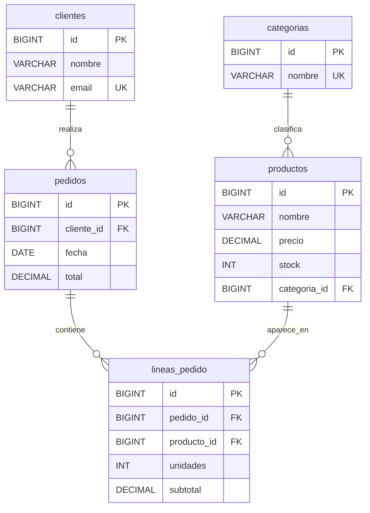

# Ejemplos ejecutables de la UD 9

Estos ejemplos están pensados para acompañar la teoría de acceso a bases de
datos con Kotlin. Todos usan la misma base de datos H2 en fichero, la recrean
con datos semilla al arrancar y se pueden ejecutar de forma independiente.

## Diagrama entidad-relación

El proyecto trabaja sobre una base de datos pequeña de tienda. Este diagrama
resume las entidades y las relaciones que se usan en los ejemplos.



Lectura rápida del modelo:

- Una `categoria` puede tener muchos `productos`.
- Un `cliente` puede realizar muchos `pedidos`.
- Un `pedido` se descompone en varias `lineas_pedido`.
- Cada `linea_pedido` referencia un único `producto`.

## Cómo se ejecutan

1. Entra en la carpeta del proyecto:

```bash
cd .
```

2. Lista las tareas disponibles:

```bash
./gradlew listarEjemplos
```

3. Ejecuta la versión que te interese. Cada ejemplo tiene dos variantes:
   - `simple`: va directo al concepto que se quiere probar, con el mínimo código alrededor.
   - `completo`: enseña el mismo concepto intentando aplicar mejores prácticas (separación en repositorios/servicios, uso de contratos, validaciones, etc.).

```bash
./gradlew runConexionValida_simple
./gradlew runConexionValida_completo
```

## Mapa de microejemplos

### ConexionValida

- Qué intenta hacer: abrir una conexión JDBC directa contra H2, mostrar la URL de conexión y comprobar que la conexión responde con `isValid`.
- Qué aporta la completa: encapsula la comprobación en un servicio y devuelve un informe con la URL, el estado de la conexión y una consulta mínima al esquema.
- Ejecuta (simple): `./gradlew runConexionValida_simple`.
- Ejecuta (completa): `./gradlew runConexionValida_completo`.

### StatementSoloLectura

- Qué intenta hacer: mostrar cuándo puede usarse `Statement`: una consulta fija, de solo lectura y sin datos externos.
- Qué aporta la completa: separa la lectura en un servicio y representa cada fila de inventario con un objeto Kotlin.
- Ejecuta (simple): `./gradlew runStatementSoloLectura_simple`.
- Ejecuta (completa): `./gradlew runStatementSoloLectura_completo`.

### PreparedSelectParametro

- Qué intenta hacer: ejecutar una consulta filtrada por precio usando `PreparedStatement` y parámetros `?`.
- Qué aporta la completa: introduce un objeto de criterio, un repositorio de búsqueda y compara SQL concatenado inseguro frente a SQL parametrizado.
- Ejecuta (simple): `./gradlew runPreparedSelectParametro_simple`.
- Ejecuta (completa): `./gradlew runPreparedSelectParametro_completo`.

### SelectBasico

- Qué intenta hacer: ejecutar un `SELECT`, recorrer el `ResultSet` y leer columnas para imprimir productos.
- Qué aporta la completa: mueve el SQL a un repositorio y devuelve objetos `ProductView` en lugar de imprimir directamente desde JDBC.
- Ejecuta (simple): `./gradlew runSelectBasico_simple`.
- Ejecuta (completa): `./gradlew runSelectBasico_completo`.

### InsertBasico

- Qué intenta hacer: insertar un producto con una sentencia `INSERT` parametrizada y comprobar las filas insertadas.
- Qué aporta la completa: añade un servicio con validaciones, un repositorio de escritura y una lectura posterior para devolver el producto insertado.
- Ejecuta (simple): `./gradlew runInsertBasico_simple`.
- Ejecuta (completa): `./gradlew runInsertBasico_completo`.

### UpdateBasico

- Qué intenta hacer: actualizar el stock de un producto con `UPDATE` parametrizado y revisar cuántas filas se modifican.
- Qué aporta la completa: valida el nuevo stock, comprueba que se haya actualizado exactamente una fila y devuelve el producto ya actualizado.
- Ejecuta (simple): `./gradlew runUpdateBasico_simple`.
- Ejecuta (completa): `./gradlew runUpdateBasico_completo`.

### DeleteBasico

- Qué intenta hacer: crear un producto temporal y borrarlo con una sentencia `DELETE` parametrizada.
- Qué aporta la completa: separa creación temporal, borrado y lectura de verificación en servicio y repositorio, comprobando además el número de filas borradas.
- Ejecuta (simple): `./gradlew runDeleteBasico_simple`.
- Ejecuta (completa): `./gradlew runDeleteBasico_completo`.

### MapeoFilaAObjeto

- Qué intenta hacer: transformar una fila de `ResultSet` en un objeto `ProductView` después de un `JOIN`.
- Qué aporta la completa: extrae el mapeo a un `ProductRowMapper` reutilizable y deja al repositorio la responsabilidad de consultar.
- Ejecuta (simple): `./gradlew runMapeoFilaAObjeto_simple`.
- Ejecuta (completa): `./gradlew runMapeoFilaAObjeto_completo`.

### MapeoUnoAMuchos

- Qué intenta hacer: observar cómo una relación cliente-pedidos aparece como varias filas repetidas tras un `JOIN`.
- Qué aporta la completa: reconstruye un agregado `CustomerWithOrders`, acumula pedidos y contempla clientes sin pedidos con `LEFT JOIN`.
- Ejecuta (simple): `./gradlew runMapeoUnoAMuchos_simple`.
- Ejecuta (completa): `./gradlew runMapeoUnoAMuchos_completo`.

### GestionSQLException

- Qué intenta hacer: provocar una restricción de email duplicado para ver una `SQLException`, su `SQLState` y el mensaje técnico del driver.
- Qué aporta la completa: traduce el error SQL a una excepción de dominio comprensible, manteniendo la causa original para diagnóstico.
- Ejecuta (simple): `./gradlew runGestionSQLException_simple`.
- Ejecuta (completa): `./gradlew runGestionSQLException_completo`.

### CierreRecursosUse

- Qué intenta hacer: cerrar correctamente `Connection`, `PreparedStatement` y `ResultSet` con llamadas anidadas a `use`.
- Qué aporta la completa: encapsula el patrón de cierre automático en un lector reutilizable que devuelve datos ya desacoplados de JDBC.
- Ejecuta (simple): `./gradlew runCierreRecursosUse_simple`.
- Ejecuta (completa): `./gradlew runCierreRecursosUse_completo`.

### TransaccionCommit

- Qué intenta hacer: agrupar la creación de un pedido y el descuento de stock en una misma transacción confirmada con `commit`.
- Qué aporta la completa: concentra la unidad de trabajo en un servicio transaccional y oculta al `main` los detalles de `autoCommit`, `commit` y `rollback`.
- Ejecuta (simple): `./gradlew runTransaccionCommit_simple`.
- Ejecuta (completa): `./gradlew runTransaccionCommit_completo`.

### TransaccionRollback

- Qué intenta hacer: forzar un fallo después de un `INSERT` para demostrar que `rollback` deshace los cambios de la transacción.
- Qué aporta la completa: cuenta pedidos antes y después del fallo para comprobar de forma observable que no quedaron cambios persistidos.
- Ejecuta (simple): `./gradlew runTransaccionRollback_simple`.
- Ejecuta (completa): `./gradlew runTransaccionRollback_completo`.

### DaoBasico

- Qué intenta hacer: consultar clientes mediante una interfaz DAO y una implementación JDBC mínima.
- Qué aporta la completa: añade un servicio que depende del contrato DAO, separando caso de uso e implementación JDBC.
- Ejecuta (simple): `./gradlew runDaoBasico_simple`.
- Ejecuta (completa): `./gradlew runDaoBasico_completo`.

### DaoConServicio

- Qué intenta hacer: usar un servicio de aplicación que obtiene correos de clientes a través de un DAO.
- Qué aporta la completa: introduce una factoría de DAOs para desacoplar la creación de implementaciones y reforzar la dependencia por contratos.
- Ejecuta (simple): `./gradlew runDaoConServicio_simple`.
- Ejecuta (completa): `./gradlew runDaoConServicio_completo`.

### PoolHikariBasico

- Qué intenta hacer: crear un pool HikariCP, pedir una conexión prestada y comprobar que es válida.
- Qué aporta la completa: usa el pool desde un servicio y muestra una métrica básica después de devolver la conexión.
- Ejecuta (simple): `./gradlew runPoolHikariBasico_simple`.
- Ejecuta (completa): `./gradlew runPoolHikariBasico_completo`.
